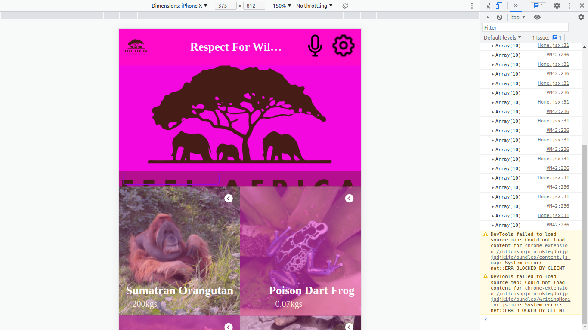
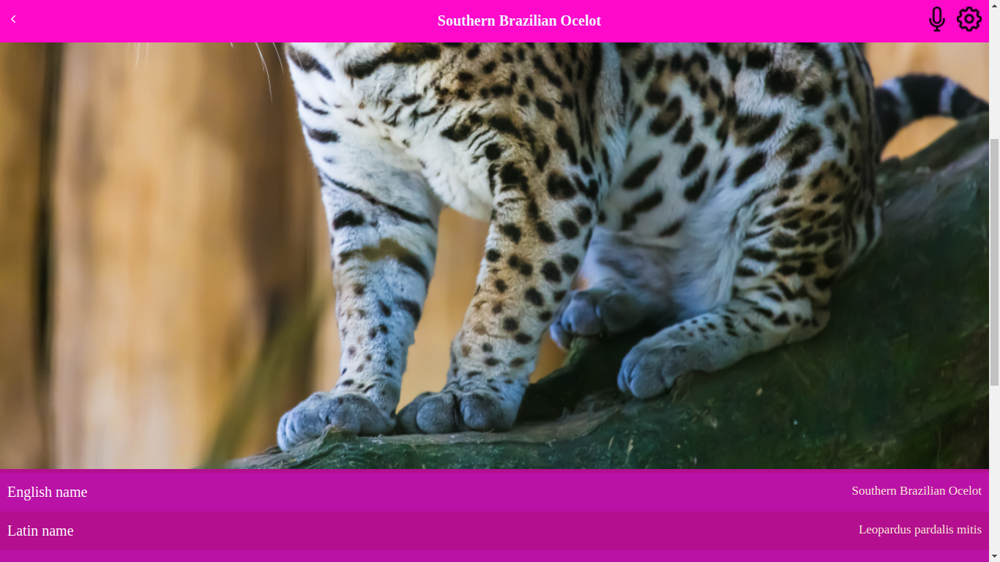

# Metrics ReactApp

> In this project I built a mobile web application to check a list of animals making use of React and Redux.

## ScreenShots



## Built With

- React
- Redux
- CSS
- JavaScript
- HTML

## Live Demo
[Live Demo]()

## Setup project in your local machine
  To get a local copy of the project, follow these steps: 
1. Open the terminal and navigate to the folder where you would     like to put these files.
2. Type the following commands into the terminal: 

 git clone https://github.com/Have-Samuel/reactRedux-Capstone

 cd reactReddux-Capstone

 ##Run Project

- $ npm install
- $ npm run start # this will make webpack watching for your changes in code

### Open page in browser

```bash
$ open dist/index.html
```

## Author

👤 **Have Samuel**

- GitHub: [Have-Samuel](https://github.com/Have-Samuel)
- Twitter: [@samhave1](https://twitter.com/@samhave1)
- LinkedIn: [Have Samuel Kabreebe](https://linkedin.com/in/Have-Samuel-Kabreebe)

## Credential

## 🤝 Contributing

Contributions, issues, and feature requests are welcome!

Feel free to check the [issues page](https://github.com/Have-Samuel/reactRedux-Capstone/issues).

## Show your support

Give a ⭐️ if you like this project!

## Acknowledgments

- Thanks to my peers who are always there to offer support. 
- Original design idea by Nelson Sakwa on Behance.

## 📝 License

This project is [MIT](./MIT.md) licensed.
